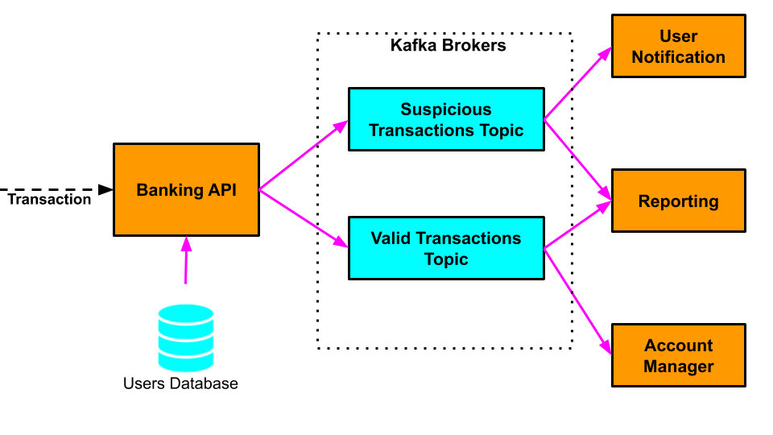
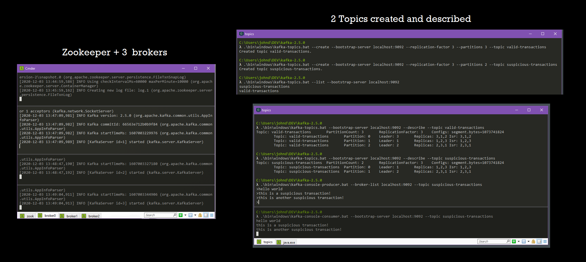

# Distributed Banking System

A distributed banking system built with Java and Apache Kafka, comprising multiple microservices that process card transactions and detect suspicious activity based on location mismatches.
Includes services for transaction validation, customer notifications, account management, and reporting, all communicating through Kafka topics with a fault-tolerant multi-broker cluster.



## Services

- **bank-api-service**: entry point to the system. Reads incoming customer card transactions and, for each one, looks up the customer's home address and compares it against the transaction location. Valid transactions (locations match) are produced to `valid-transactions`, mismatches to `suspicious-transactions`, and any transaction over 1000 is also produced to `high-value-transactions`. Kafka message key is the username, value is the `Transaction`.
- **user-notification-service**: consumes `suspicious-transactions` and surfaces them for customer approval.
- **account-manager**: consumes `valid-transactions` and processes them for normal settlement.
- **reporting-service**: consumes `valid-transactions`, `suspicious-transactions` and `high-value-transactions` for reporting across all transaction activity.

All inter-service communication runs through Kafka topics.

## Kafka Cluster

Fault-tolerant, scalable cluster:

- 3 brokers, listening on ports 9092, 9093 and 9094
- `valid-transactions`: 3 partitions, replication factor 3
- `suspicious-transactions`: 2 partitions, replication factor 3
- `high-value-transactions`



## Running the Project

### Prerequisites

- Java 12+
- Maven
- Docker

### 1. Start the Kafka cluster

```bash
docker compose up -d
```

Brings up a 3-broker cluster (ports 9092, 9093, 9094) and creates `valid-transactions`, `suspicious-transactions` and `high-value-transactions`.

### 2. Build the services

```bash
./scripts/build.sh
```

### 3. Start the services

```bash
./scripts/start-bank-service.sh
./scripts/start-account-service.sh
./scripts/start-user-service.sh
./scripts/start-reporting-service.sh
```

`bank-api-service` reads transactions from `user-transactions.txt` and produces to Kafka; the other three consume and print what they receive.

## License

[MIT](LICENSE)

